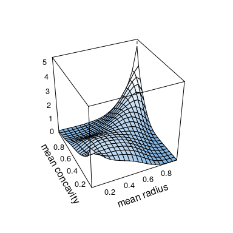

<!-- README.md is generated from README.Rmd. Please edit that file -->
kdecopula
=========

> Kernel smoothing for bivariate copula densities

[](https://travis-ci.org/tnagler/kdecopula) [](https://ci.appveyor.com/project/tnagler/kdecopula) [](https://cran.r-project.org/web/packages/kdecopula/index.html) [](https://cran.r-project.org/web/packages/kdecopula/index.html)

This package provides fast implementations of kernel estimators for the copula density. Due to its several plotting options it is particularly useful for the exploratory analysis of dependece structures. It can be further used for flexible nonparametric estimation of copula densities and resampling.

You can install:

-   the stable release on CRAN:

    ``` r
    install.pacakges("VineCopula")
    ```

-   the latest development version:

    ``` r
    devtools::install_github("tnagler/VineCopula")
    ```

------------------------------------------------------------------------

Functions
---------

The package provides the following functions:

-   `kdecop`: Kernel estimation of a copula density. By default, estimation method and bandwidth are selected automatically. Returns an object of class `kdecopula`.

-   `dkdecop`: Evaluates the density of a `kdecopula` object.

-   `pkdecop`: Evaluates the distribution function of a `kdecopula` object.

-   `rkdecop`: Simulates synthetic data from a `kdecopula` object.

-   `plot.kdecopula`, `contour.kdecopula`: Surface and contour plots of the density estimate.

Look up the package documentation for more details on arguments and options,

------------------------------------------------------------------------

kdecopula in action
-------------------

In this document, we demonstrate the main capabilities of the `kdecopula` package. All user-level functions will be introduced and demonstrated on simulated data.

``` r
library(kdecopula)
```

First we simulate data from a Clayton copula via `BiCopSim` from the `VineCopula` package.

``` r
library(VineCopula)
clay3 <- BiCop(family = 3, par = 3)
u <- BiCopSim(500, clay3)
plot(u)
```


#### Estimation of bivariate copula densities

We start by estimating the copula density with the `kdecop` function. There is a number of options for the smoothing parameterization, estimation method and evaluation grid, but it is only required to provide a data-matrix.

``` r
kde.fit <- kdecop(u, info = TRUE)
kde.fit$info
#> $likvalues
#>   [1]   1.86205370   0.38811982   1.55431266   1.85259679   3.78020465
#>   [6]   1.59160695   0.31448773   2.63586906 119.33693114   1.88935942
#>  [11]   1.60090634   2.10652816   2.71729282   1.83224130   1.05010351
#>  [16]   1.92167650   2.17052754   1.81470983   1.22288916   1.59864031
#>  [21]   0.81752075   2.64803500   1.21888885   1.60113865   2.68919176
#>  [26]   1.88189277   3.09410050   1.97166856   4.20258435   1.87451027
#>  [31]   0.03678330   2.09796779   1.62286877   2.08111686   1.50530559
#>  [36]   2.23409327   1.56591090   2.00685211   1.81571121   2.07017004
#>  [41]   2.95033073   1.97597487   1.18764562   3.82537261   1.67550183
#>  [46]   1.41138097   7.68696338   1.84942521   7.59340719   3.29482158
#>  [51]   2.90523575  14.15843177   2.52147226   1.44636219   0.44490045
#>  [56]   2.70470077   1.89459020   2.82056982   1.81730723   1.84946248
#>  [61]   2.24713641   1.59778723   1.96184687   1.70846214   5.55662242
#>  [66]   1.71345884   2.28546897   1.86606510   2.12087700   1.41026016
#>  [71]   1.57282528   1.72212484   1.57389536   1.19289260   2.43190045
#>  [76]   2.32641131   1.94778962   1.31010833   1.77862165   2.40007220
#>  [81]   1.97349730   2.68153552   7.83393108   1.41999274   1.27888349
#>  [86]   2.66318501   4.17754106   1.32294296   1.86547052   1.79963987
#>  [91]   1.34461773   0.67231408   7.91344411   6.92979539   1.06913705
#>  [96]   0.84988490   2.81576440   0.99003867   2.93418347   1.19105534
#> [101]   1.33217833   1.63391796   2.23963085   0.40782210   1.82688253
#> [106]   0.98842264   4.79466310   6.24835851   3.48611177   0.35427131
#> [111]   1.67643019   3.78635080   3.23282915   1.63250450   0.09903714
#> [116]   0.71299655   3.14203408   1.02148402   1.22330361   3.30312675
#> [121]   1.81308436   1.12625911   0.89784801   2.36511252   1.92258538
#> [126]   2.03578132   4.47580171   1.83206660   0.28797534   2.21464042
#> [131]   1.19658283   2.71830118   0.40899482   1.56345594   1.84339881
#> [136]   4.87858226   1.34013671   3.74599728   2.10164641   2.60808341
#> [141]   2.70507227   0.06407220   0.77194000   1.73614249   1.84698763
#> [146]   3.25396342   2.40338366   1.43331375   7.23671289   1.70499633
#> [151]   2.38835118   2.42494938   1.74538693  38.20366969   2.81546291
#> [156]   1.39447519   1.57748151   2.69424027   2.26052825   1.67294097
#> [161]   0.72203269  10.91108398   1.95200280   3.53386183   2.20914908
#> [166]   1.77137210   1.34254573   1.90369929   1.34474594   6.18182510
#> [171]   1.91708592   1.87129509   1.75350758   1.56522013   0.93288239
#> [176]   1.37884642   0.28376726   5.46596001   0.11594282   0.55191285
#> [181]   1.84442154   1.94754726   5.85485344   1.58515886   1.49914195
#> [186]   3.15433675   1.02235492   0.66984309   2.32911902   0.45447448
#> [191]   1.96169706   1.71579582   1.41796736   0.77860864   2.14826638
#> [196]   1.72529383   1.51540678   0.84386232   1.54107685   0.38446604
#> [201]   1.20880986   0.93089967   2.48813486  24.58783968   4.24149354
#> [206]   0.56961188   1.65840408   1.72135190   2.07715400  18.69671475
#> [211]   2.93942872   2.84354772   1.92249180   1.81987485   2.02540981
#> [216]   5.78449724   0.82170937   2.06520566   1.02032239   2.09179124
#> [221]   1.87763461  23.56177572   0.72609914   8.11961142   4.15399047
#> [226]   1.05889611   1.54442553   1.79361963   2.00837465   4.71217056
#> [231]   1.87082216   1.92629470   1.28898944   0.79901024   3.36671570
#> [236]   0.37522448   2.75741622   2.28153962  97.66544144   7.12398019
#> [241]   1.86863772   0.77582072   1.82226220  17.15102913   1.97429602
#> [246]   2.30895908   0.76209636   1.43432382   1.73919365   1.73435164
#> [251]   1.73019971   1.44878509   1.83090535   1.61439520   1.83265101
#> [256]   1.58899882   2.93170748   1.03449224   1.82678801   1.79956129
#> [261]   4.74388442   3.62383861   8.54250287   1.70389565   0.97144000
#> [266]   2.96335106   2.71853358   1.86243320   2.79845003   2.62178276
#> [271]   1.73475666   5.42046334   1.61144011   2.81490903   3.94433676
#> [276]   1.83493376   1.87519683   0.95662138   4.00075912   4.87776974
#> [281]   6.89406674  14.32026858   1.87996826   1.64009278   1.25797227
#> [286]   4.29114800   2.35501071   0.06179823   3.54115996   1.78307845
#> [291]   4.28964405   2.43609845   1.70056932   0.47644128   1.42150618
#> [296]   2.17521941   3.35927138   1.99367701   2.62834531  57.46331933
#> [301]   1.99234108   1.16145359   0.33201797   1.84368177   5.30815859
#> [306]   0.60436187   2.28420476   2.01743194   1.36635809   2.56529092
#> [311]  14.72721616   1.92713070   1.71121866   1.78147860   1.99032950
#> [316]   3.22791810   1.09357183   0.42993340   1.32855672   1.20507589
#> [321]   0.98602010   2.64625107   0.92011612   2.08635906   3.03343613
#> [326]   1.59006071   1.62140626   1.55824517   3.93163734   2.06494069
#> [331]   1.80566513   1.80046030   1.08218021   1.75527215   1.71557618
#> [336]   1.85149999   1.60423285   1.60000019   2.34228025   1.77003913
#> [341]   1.82982260   1.67046204   0.50297409   3.09870061   1.74833044
#> [346]   0.29554559   0.93931026   0.97134930   1.60266547   0.38051567
#> [351]   1.98448528   3.84709570   2.32013650  10.90239065   1.85654034
#> [356]   1.86922936   0.43066200   0.70791255   1.46555260   1.31591778
#> [361]   2.60536825   2.01771591   3.81070694   1.94276068   1.78266098
#> [366]   3.30455591   0.09981096   0.66332739   0.13196511   1.30099753
#> [371]   1.53643945   2.05981868   1.00204372   5.87327738   2.95016551
#> [376]   2.48338083   2.26034003  11.06802800   1.66536749   1.05846520
#> [381]   1.82544127   1.59968277   1.07774671   1.75641830   1.80771589
#> [386]   3.32601771   3.20117946   0.66846666   1.89952841   0.63156945
#> [391]   1.81227894   1.51911063   1.78045423   0.61645747   2.91891727
#> [396]   1.57034785   1.68273047   1.40429895   4.39349905   2.73772361
#> [401]   5.76604763   4.25800997   6.81942497   1.77246901   0.63580034
#> [406]   2.03527727   1.28001676   0.58061557   1.89093840   3.07695373
#> [411]   1.93286289   1.76035395   4.20273875   1.94710024   3.09568733
#> [416]   1.14444376   1.40228710  30.04108063   0.73329628   2.37017568
#> [421]   2.30046977   1.93667455   1.49124247   3.24625462   1.77204489
#> [426]   0.45087362   2.75642583   4.43263822   1.49306324   1.69925416
#> [431]   1.66882776   2.16213964   1.07876640   1.88765820   7.73405395
#> [436]   0.97800991   0.16031784   4.35531021   4.95809899   2.14611703
#> [441]   5.66034072   2.48027537   1.91495861   1.31168945   1.03275594
#> [446]   0.65957828   1.89652690   1.77728030   2.05038334   1.81017080
#> [451]   1.48164237   2.05660742   1.21057408   3.60847466   1.94390580
#> [456]   1.29335054   2.48396798   0.47309287   2.46480712   3.62264685
#> [461]   2.39384860   1.61467511   1.67760537   0.95748656   1.92471964
#> [466]   1.06597204   1.24827685   1.58831848   0.73418520   1.81679356
#> [471]   4.33012783  22.26345391   3.11450042   2.99302787   6.35058991
#> [476]   2.68772704   0.68352017   1.15823830   1.85210475   2.33318952
#> [481]   7.94269058   2.44321965   1.80554865   1.20884879   5.80874641
#> [486]   0.42278574   0.24484598   1.91983239   0.96954851   1.48451007
#> [491]   2.57003048   1.61413000   2.41345660   1.44883487   3.45369649
#> [496]   1.86758996   1.49469289   2.67416906   1.39701413   1.91201293
#> 
#> $loglik
#> [1] 317.0219
#> 
#> $effp
#> [1] 11.47185
#> 
#> $AIC
#> [1] -611.1002
#> 
#> $cAIC
#> [1] -610.5133
#> 
#> $BIC
#> [1] -562.7508
```

The additional option `info = TRUE` provides extra information like *AIC* or *effective number of parameters*; default is `FALSE`. The output of the function is an object of class `kdecopula` that contains all information collected during the process.

#### Working with a `kdecopula` object

The density and *cdf* can be computed easily:

``` r
dkdecop(c(0.1, 0.2), kde.fit)
#> [1] 2.375801
pkdecop(c(0.1, 0.2), kde.fit)
#> [1] 0.09418556
```

Furthermore, we can simulate synthetic data from the estimated density:

``` r
unew <- rkdecop(500, kde.fit)
plot(unew)
```



#### Plotting bivariate copula densities

The most interesting part for most people is probably to make exploratory plots. The class `kdecopula` has its own generic for plotting. In general, there are two possible types of plots: *contour* and *surface* (or perspective) plots. Additionally, the `margins` argument allows to choose between a plot of the original copula density and a meta-copula density with standard normal margins (default for `type = surface`).

``` r
plot(kde.fit)
```


``` r
contour(kde.fit)
```


``` r
contour(kde.fit, margins = "unif")
```


