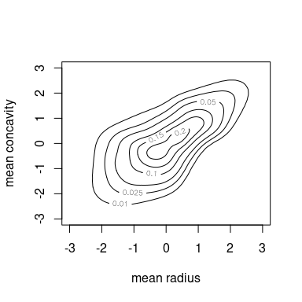
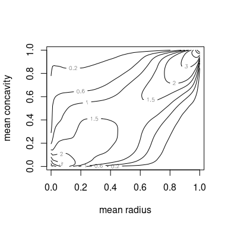
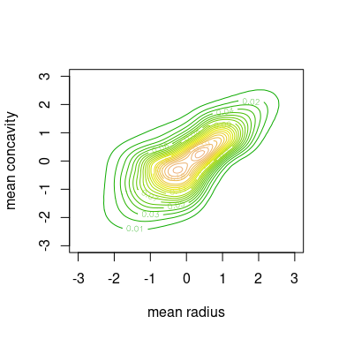
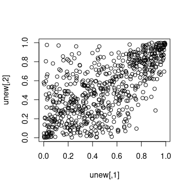

kdecopula
=========

> Kernel smoothing for bivariate copula densities

[](https://cran.r-project.org/web/packages/kdecopula/index.html) [](https://cran.r-project.org/web/packages/kdecopula/index.html)

This package provides fast implementations of kernel estimators for the copula density. Due to its several plotting options it is particularly useful for the exploratory analysis of dependence structures. It can be further used for flexible nonparametric estimation of copula densities and resampling.

You can install:

-   the stable release on CRAN:

    ``` r
    install.pacakges("kdecopula")
    ```

-   the latest development version:

    ``` r
    devtools::install_github("tnagler/kdecopula")
    ```

A detailed package description is available in the package vignette:

``` r
library("kdecopula")
vignette("kdecopula")
```

------------------------------------------------------------------------

Functions
---------

The package provides the following functions:

-   `kdecop`: Kernel estimation of a copula density. By default, estimation method and bandwidth are selected automatically. Returns an object of class `kdecopula`.

-   `dkdecop`: Evaluates the density of a `kdecopula` object.

-   `pkdecop`: Evaluates the distribution function of a `kdecopula` object.

-   `rkdecop`: Simulates synthetic data from a `kdecopula` object.

-   Methods for class `kdecopula`:

    -   `plot`, `contour`: Surface and contour plots of the density estimate.

    -   `print`, `summary`: Displays further information about the density estimate.

    -   `logLik`, `AIC`, `BIC`: Extracts fit statistics.

Please look up the package documentation for more details on arguments and options.

------------------------------------------------------------------------

kdecopula in action
-------------------

Below, we demonstrate the main capabilities of the `kdecopula` package. All user-level functions will be introduced with small examples.

Let's consider some variables of the *Wiscon diagnostic breast cancer* data included in this package. The data are transformed to pseudo-observations of the copula by the empirical probability integral/rank transform:

``` r
library(kdecopula)
data(wdbc)  # load data
u <- apply(wdbc[, c(2, 8)], 2, rank) / (nrow(wdbc) + 1)  # empirical PIT
plot(u)  # scatter plot
```

<!-- -->

We see that the data are slightly asymmetric w.r.t. both diagonals. Common parametric copula models are usually not flexible enough to reflect this. Let's see how a kernel estimator does.

#### Estimation of bivariate copula densities

We start by estimating the copula density with the `kdecop` function. There is a number of options for the smoothing parameterization, estimation method and evaluation grid, but it is only required to provide a data-matrix.

``` r
kde.fit <- kdecop(u)  # kernel estimation (bandwidth selected automatically)
summary(kde.fit)
#> Kernel copula density estimate
#> ------------------------------
#> Variables:    mean radius -- mean concavity 
#> Observations: 569 
#> Method:       Transformation local likelihood, log-quadratic ('TLL2') 
#> Bandwidth:    alpha = 0.353621
#>               B = matrix(c(0.71, 0.7, -1.09, 1.09), 2, 2)
#> ---
#> logLik: 197.28    AIC: -360.19    cAIC: -359.06    BIC: -285.56 
#> Effective number of parameters: 17.18
```

The output of the function `kdecop` is an object of class `kdecopula` that contains all information collected during the estimation process and summary statistics such as *AIC* or the *effective number of parameters/degrees of freedom*. These can also be accessed directly, e.g.

``` r
logLik(kde.fit)
#> 'log Lik.' 197.2755 (df=17.18016)
AIC(kde.fit)
#> [1] -360.1907
```

#### Plotting bivariate copula densities

The most interesting part for most people is probably to make exploratory plots. The class `kdecopula` has its own generic for plotting. In general, there are two possible types of plots: *contour* and *surface* (or perspective) plots. Additionally, the `margins` argument allows to choose between plots of the original copula density and a meta-copula density with standard normal margins (default for `type = contour`).

``` r
plot(kde.fit)
```

<!-- -->

``` r
contour(kde.fit)
```

<!-- -->

``` r
contour(kde.fit, margins = "unif")
```

<!-- -->

You can also pass further arguments to the `...` argument to refine the aesthetics. The arguments are forwaded to
`lattice::wireframe` or `graphics::contour`, respectively.

``` r
plot(kde.fit, 
     zlim = c(0, 10),  # z-axis limits
     screen = list(x = -75, z = 45),  # rotate screen
     xlab = list(rot = 25),  # labels can be rotated as well
     ylab = list(label = "other label", rot = -25))  
```

<!-- -->

``` r
contour(kde.fit, col = terrain.colors(30), levels = seq(0, 0.3, by = 0.01))
```

<!-- -->

#### Working with a `kdecopula` object

The density and *cdf* can be computed easily:

``` r
dkdecop(c(0.1, 0.2), kde.fit)  # estimated copula density
#> [1] 1.690376
pkdecop(cbind(c(0.1, 0.9), c(0.1, 0.9)), kde.fit) # corresponding copula cdf
#> [1] 0.03254441 0.85154412
```

Furthermore, we can simulate synthetic data from the estimated density:

``` r
unew <- rkdecop(655, kde.fit)
plot(unew)
```

<!-- -->

We see that the asymmetries observed in the data are adequately reflected by the estimated model.

References
----------

Gijbels, I. and Mielniczuk, J. (1990). Estimating the density of a copula function. *Communications in Statistics - Theory and Methods*, 19(2):445-464.

Charpentier, A., Fermanian, J.-D., and Scaillet, O. (2006). The estimation of copulas: Theory and practice. In Rank, J., editor, Copulas: From theory to application in finance. Risk Books.

Geenens, G., Charpentier, A., and Paindaveine, D. (2014). Probit transformation for nonparametric kernel estimation of the copula density. [*arXiv:1404.4414 (stat.ME)*](arxiv.org/abs/1404.4414).

Nagler, T. (2014). Kernel Methods for Vine Copula Estimation. [*Master's Thesis, Technische Universität München*](https://mediatum.ub.tum.de/node?id=1231221)

Wen, K. and Wu, X. (2015). Transformation-Kernel Estimation of the Copula Density, Working paper, [preprint](http://agecon2.tamu.edu/people/faculty/wu-ximing/agecon2/public/copula.pdf)
